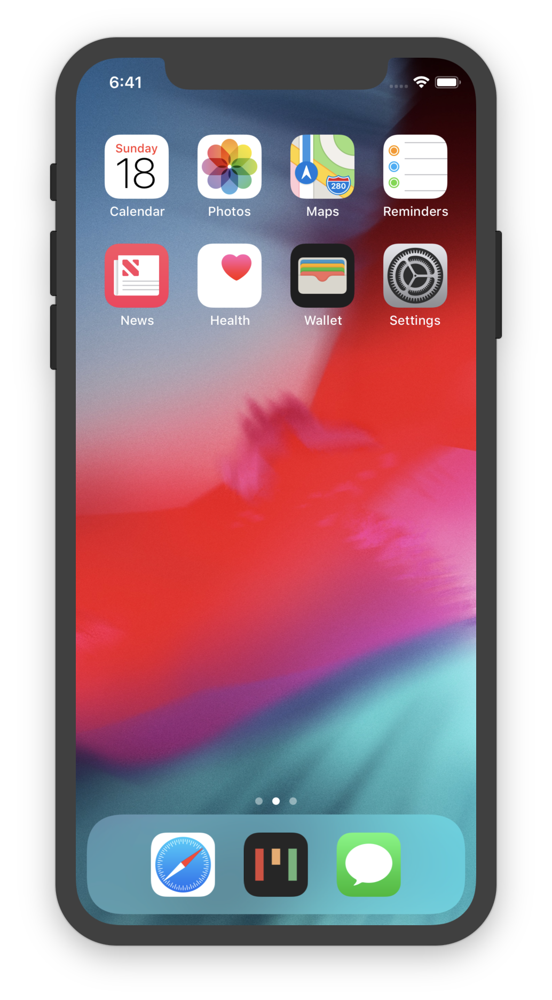
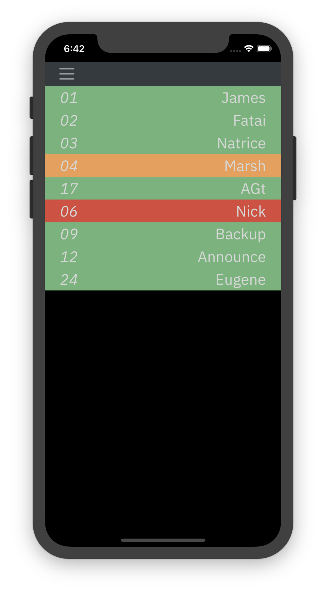
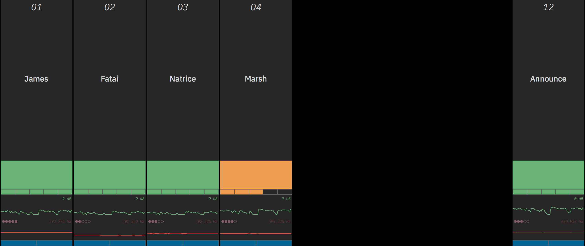

# Micboard
Micboard - A visual monitoring tool for network enabled Shure devices.

Micboard simplifies microphone monitoring and storage for artists, engineers, and volunteers.  View battery, audio, and RF levels from any device on the network.

## Screenshots

  

  

  

## Compatible Networks & Devices
Micboard currently relies on IP addresses to connect to RF devices.  RF devices can be addressed through static or reserved IPs.  They just need to be consistent.

Micboard supports the following devices -
* UHF-R
* QLX-D[1](#qlxd)
* ULX-D
* Axient Digital
* PSM 1000

## Interface

### Keyboard Shortcuts
* <kbd>0</kbd> - Show all slots
* <kbd>1</kbd>...<kbd>9</kbd> - Go to group
* <kbd>d</kbd> - Start demo mode
* <kbd>e</kbd> - Open group editor
* <kbd>f</kbd> - Toggle fullscreen
* <kbd>g</kbd> - Change image backgrounds
* <kbd>v</kbd> - Change video backgrounds
* <kbd>i</kbd> - Change display mode
* <kbd>n</kbd> - Extended Name editor
* <kbd>q</kbd> - Show QR code
* <kbd>t</kbd> - TV mode (toggle)
* <kbd>esc</kbd> - reload micboard

## Additional Documentation
* [Use Micboard across a campus with Multivenue](docs/multivenue.md)
* [Building the Electron wrapper for macOS](docs/electron.md)
* [Extending micboard using the API](docs/api.md)

## Known Issues
<a name="qlxd">1</a>: [QLX-D Firmware](docs/qlxd.md)
