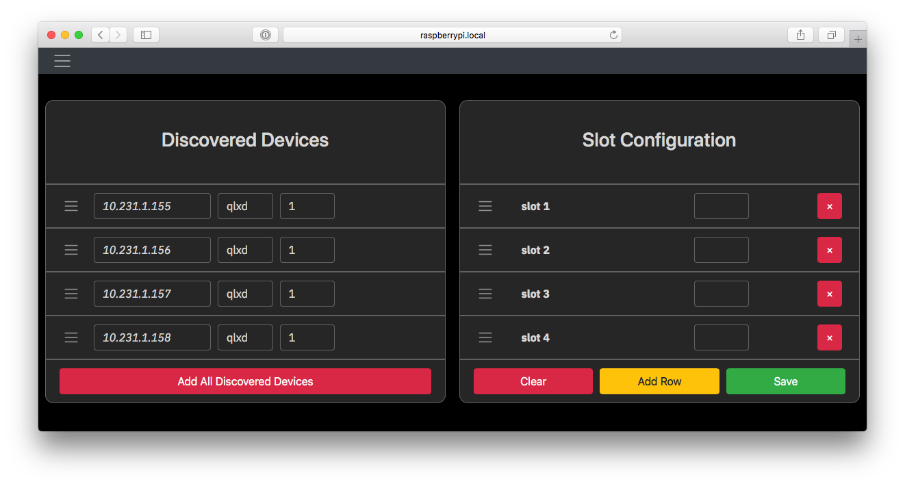
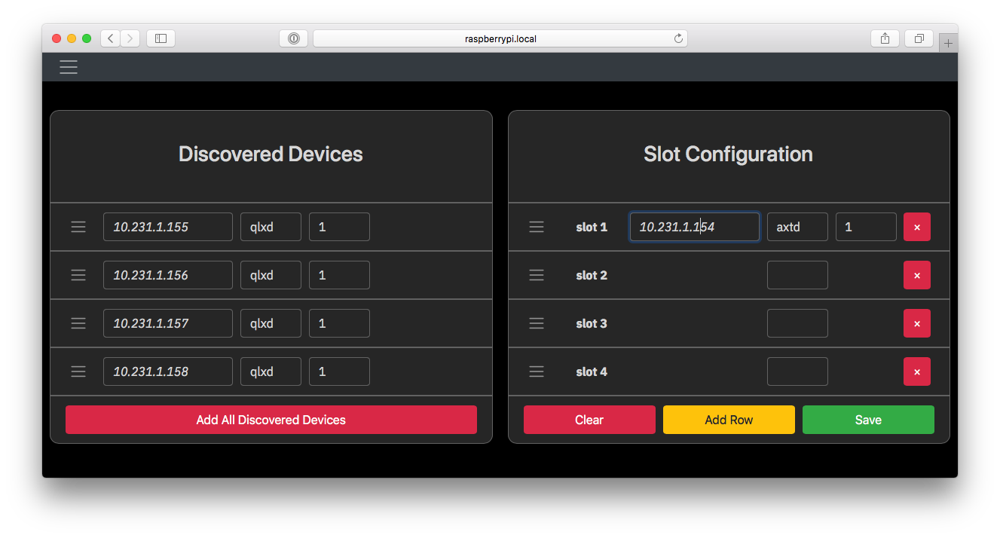
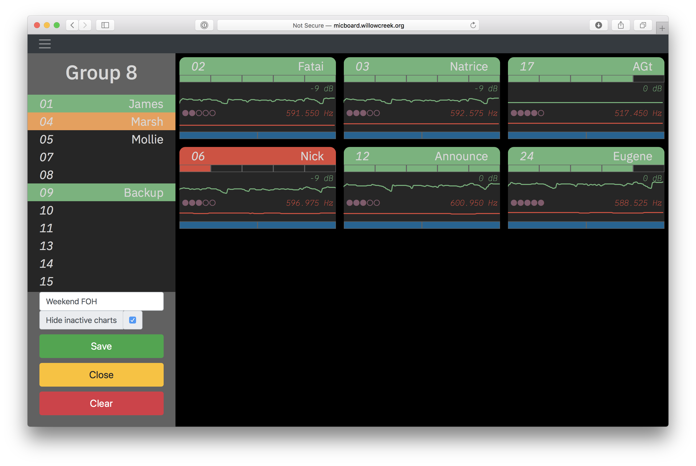
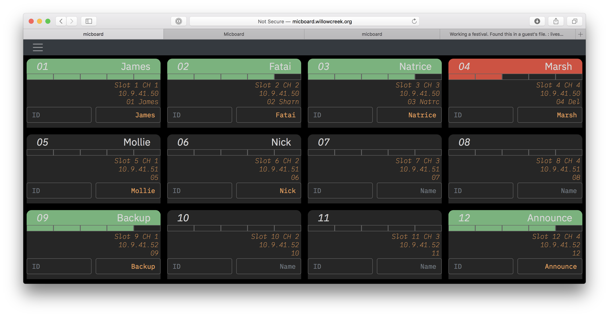
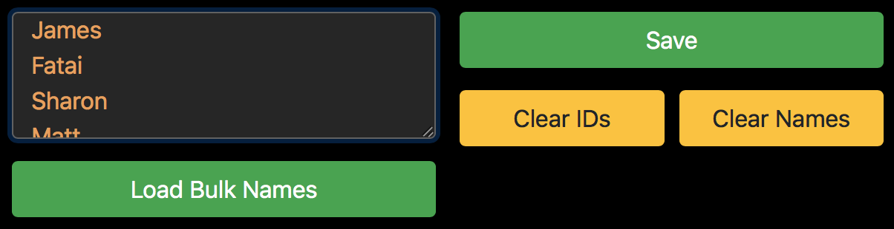

# Configuration
On first run, Micboard will open up a configuration page.  This page can also be accessed from the micboard menu and by pressing <kbd>s</kbd> from within Micboard.

<p align="center">
  
</p>

Each wireless channel is assigned unique slot. A single channel QLXD receiver would use 1 slot while a ULXD4Q receiver uses 4.  Drag and drop discovered devices into the slot configuration.  Devices can also be manually added.


<p align="center">
  
</p>

Production environments often include multiple networks.  For now, Micboard only discovers devices through the primary NIC.  On Mac OS, this would be the NIC on the top of the Service Order.  Devices on other networks may have to be manually added.  Select a device type, input an ip, and select a channel.

Press Save to apply the configuration.


## Keyboard Shortcuts
Micboard is primarily controlled with keyboard shortcuts

* <kbd>?</kbd> - Show keyboard shortcuts
* <kbd>0</kbd> - Show all slots
* <kbd>1</kbd>...<kbd>9</kbd> - Load group
* <kbd>d</kbd> - Start demo mode
* <kbd>e</kbd> - Open group editor
* <kbd>t</kbd> - Toggle TV view
* <kbd>i</kbd> - Change tv display mode
* <kbd>f</kbd> - Toggle fullscreen
* <kbd>g</kbd> - Toggle image backgrounds
* <kbd>v</kbd> - Toggle video backgrounds
* <kbd>n</kbd> - Extended Name editor
* <kbd>s</kbd> - Device configuration editor
* <kbd>q</kbd> - Show QR code
* <kbd>esc</kbd> - reload micboard

## Groups
Devices can be grouped into custom views. These groups are accessible from the menu and keyboard shortcuts.  

#### View a Group
Groups can be selected from the main menu or with numeric keys.  View all devices by pressing <kbd>0</kbd>.

#### Edit a Group

<p align="center">
  
</p>
Once in a group, open the group editor by pressing "edit group" in the nav menu.  The group editor can also be opened by pressing <kbd>e</kbd>.

Once the editor is open -
1. Add title
2. Drag and channels from sidebar to display board
3. Save

Use a dedicated group for each mic storage display.  Multiple **BLANK** boxes can be used to fill in unused spots.

## Background Images
<p align="center">
  
</p>

Image and video<sup>[1](#mp4)</sup> backgrounds can be used with Micboard. Files in the `backgrounds` folder of the micboard configuration directory are displayed based on the channel name. With backgrounds enabled, `01 Fatai` will display `fatai.jpg` as a background for the `01 Fatai` slot.


There are a few keyboard shortcuts to control background modes.
* <kbd>g</kbd> - Toggle image backgrounds
* <kbd>v</kbd> - Toggle video backgrounds


The micboard `backgrounds` folder can be shared via a fileserver.  This provides an easy way for teams to update pictures.

[Setting up a Fileserver for Micboard](fileshare.md)

## Extended Names
<p align="center">
  
</p>

Larger systems benefit from static channel IDs like 'H01' or 'bp14' and user names, like Dave.  It can be difficult to fit both in a field Shure often limits to 8 characters.

Micboard has an optional feature called **Extended Names**.  When set, user-defined names will be displayed instead of names pulled from the receiver.

When the receiver name is changed via WWB, Micboard follows suit and displays the new name.

Press <kbd>n</kbd> to bring up the extended names editor.  Press save once complete.

#### Bulk Name Loader
Names can be imported from spreadsheets and text files with the **Bulk Loader**.
<p align="center">
  
</p>

1. Open the Extended Names editor with <kbd>⇧ Shift</kbd> + <kbd>n</kbd>.
2. Paste a list of names into the bulk box.
3. Click **Load Bulk Names** to load names from the imported list.  Make any necessary edits in the extended editor and **Save**.

## Additional Configuration Options

### Local URL
By default, micboard displays the IP address of the machine as the QR code.  For machines with multiple NICs, you can specify a hostname or IP to be shown by setting the `local_url` key in `config.json`

```
  "local_url": "http://micboard.io:9000",
```

## Notes
<a name="mp4">1</a>: At this time, video backgrounds are only supported on Safari
