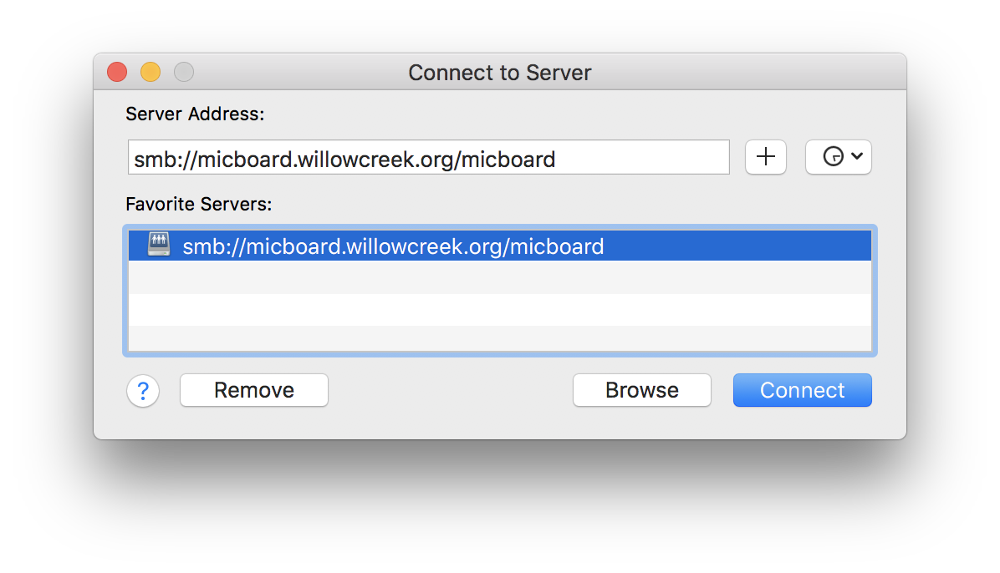
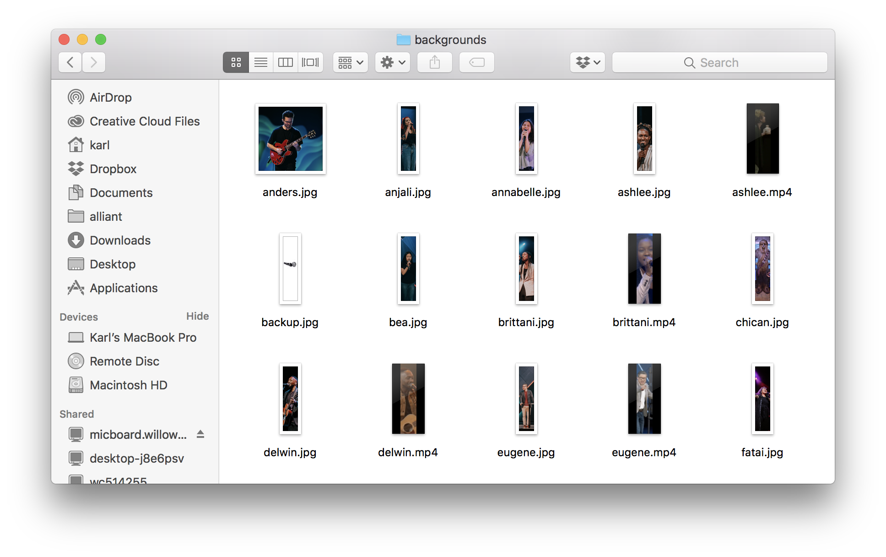
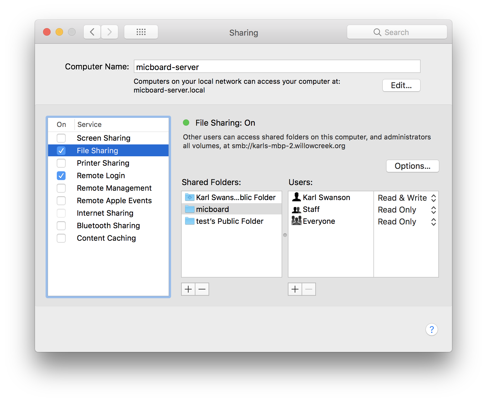

# File Sharing via Samba
<p align="center">
  
</p>


Micboard's configuration directory can be shared via [Samba](https://www.samba.org).  This makes it easy to remotely add backgrounds, edit micboard configurations, and view logs.

### MacOS

On MacOS, open up the Sharing pane within System Preferences

Enable File Sharing

Add the micboard config folder. `~/Library/Application Support/micboard/`

### Debian Servers (Ubuntu & Raspberian)
Install Samba

```
$ sudo apt-get update
$ sudo apt-get install samba
```

Add a share for micboard in /etc/samba/smb.conf

```
[micboard]
    comment = Micboard
    path = /home/micboard/.local/share/micboard
    read only = no
    browsable = yes
```

Add a user for the share
```
$ sudo smbpasswd -a micboard
```

restart samba

```
$ sudo service smbd restart
```
