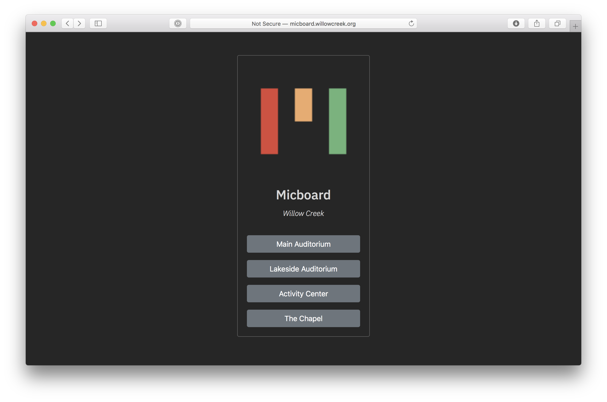

# Micboard Multivenue Server




A single server can provide separate instances of micboard for multiple venues across a campus.

For Micboard multivenue, [NGINX](https://www.nginx.com) is used as a transparent proxy server.  NGINX internally routes traffic for each venue to the correct micboard instance based on the URL.  `micboard.local/venue-a` renders the instance for venue-a while `/venue-b` serves the instance for venue b.

## Micboard Configuration
Setup and enable systemd service for each venue.


`$ cp micboard.service micboard-venue-a.service`

```
[Unit]
Description=Micboard Service
After=network.target

[Service]
# Set the network port for micboard venue-a to 8080
Environment=MICBOARD_PORT=8080
# Direct micboard to use a separate configuration path for the venue-a venue
ExecStart=/usr/bin/python3 -u py/micboard.py -f ~/.local/share/micboard/venue-a
WorkingDirectory=/home/micboard/micboard
StandardOutput=inherit
StandardError=inherit
Restart=always
# Run the service as user micboard
User=micboard
AmbientCapabilities=CAP_NET_BIND_SERVICE

[Install]
WantedBy=multi-user.target
```

Install the service
```
$ sudo cp micboard-venue-a.service /etc/systemd/system/
$ sudo systemctl start micboard-venue-a.service
$ sudo systemctl enable micboard-venue-a.service
```

## Configure Landing Page
```
$ cp static/multivenue-template.html static/multivenue.html
```

Add your venues to the page

`static/muitivenue.html`
```
<div class="card-body">
    <p class="card-text"><a href="/venue-a" class="btn btn-secondary btn-block">Venue A</a></p>
    <p class="card-text"><a href="/venue-b" class="btn btn-secondary btn-block">Venue B</a></p>
</div>
```

## Configure NGINX
Install Nginx
```
$ sudo apt update
$ sudo apt install nginx
```

A sample [nginx.conf](nginx-sample.conf) is provided in the `docs` directory.  'upstream' and `location` element must be configured for each venue.


Restart Nginx
```
$ sudo systemctl restart nginx
```

## Setup Background Fileshare
Setup [Samba](fileshare.md) to map to the micboard `backgrounds` folder.  Multiple venues can share or have separate background image repositories.

Micboard defaults to a separate backgrounds folder for each instance.  A shared directory can be set via `-b`.  For micboard multivenue, this can be set in the systemd /etc/systemd/service/micboard-venue.service file.

```bash
ExecStart=/usr/bin/python3 -u py/micboard.py -f ~/.local/share/micboard/venue-a -b ~/.local/share/micboard/backgrounds
```
