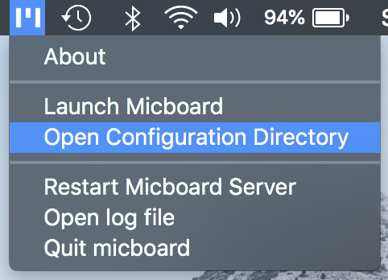
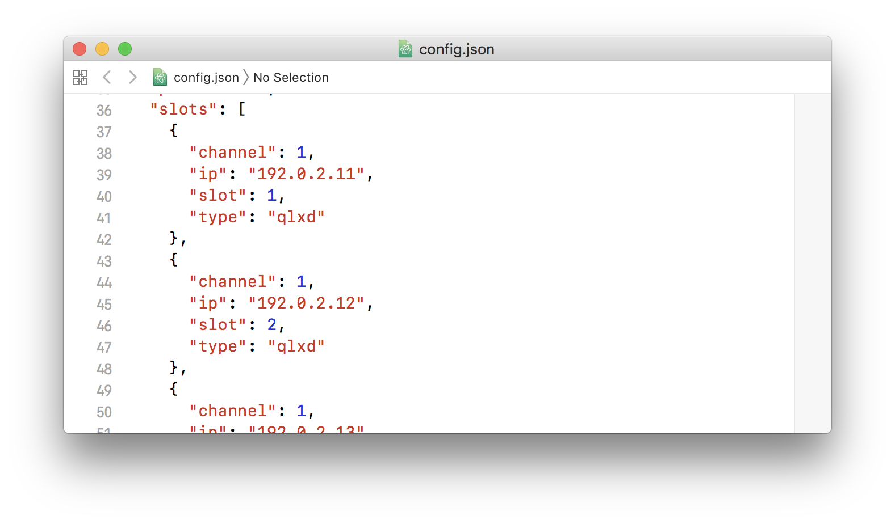
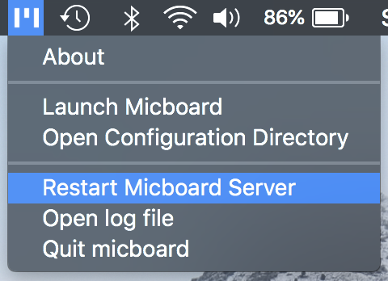

# Micboard Platforms
Micboard runs on a variety of platforms.


## Debian (Ubuntu & Raspberry Pi)
Install git, python3-pip, and Node.js
```
$ sudo apt-get update
$ sudo apt-get install git python3-pip
$ curl -sL https://deb.nodesource.com/setup_10.x | sudo -E bash -
$ sudo apt-get install nodejs
```

Download micboard
```
$ git clone https://github.com/karlcswanson/micboard.git
```

Install micboard software dependencies via npm and pip
```
$ cd micboard/
$ npm install
$ pip3 install -r py/requirements.txt
```

build the micboard frontend and run micboard
```
$ npm run build
$ python3 py/micboard.py
```

Micboard creates a blank configuration file on first run.  Open `/root/.local/share/micboard/config.json` and add in your receivers.  Check the [configuration](configuration.md) docs for more information on configuring micboard.

Edit `User` and `WorkingDirectory` within `micboard.service` to match your installation and install it as a service.
```
$ sudo cp micboard.service /etc/systemd/system/
$ sudo systemctl start micboard.service
$ sudo systemctl enable micboard.service
```


## MacOS - Desktop Application
Download and run micboard-server from the project's [GitHub Release](https://github.com/karlcswanson/micboard/releases/) page.

On first run, micboard creates a blank configuration file.  Within the micboard menubar app, selet "Open Configuration Directory"



Open `config.json` and add in your rf devices.  Check the [configuration](configuration.md) docs for more information on configuring micboard.



Once changes have been saved, restart micboard from the micboard menu.




## MacOS - From Source
Install the Xcode command-line tools
```
$ xcode-select --install
```

Install the homebrew package manager
```
$ /usr/bin/ruby -e "$(curl -fsSL https://raw.githubusercontent.com/Homebrew/install/master/install)"
```

Install python3 and node
```
$ brew install python3 node
```

Download Micboard
```
$ git clone https://github.com/karlcswanson/micboard.git
```

Install micboard software dependencies via npm and pip
```
$ cd micboard/
$ npm install
$ pip3 install -r py/requirements.txt
```

build the micboard frontend and run micboard
```
$ npm run build
$ python3 py/micboard.py
```

Micboard creates a blank configuration file on first run.  Open `~/Library/Application Support/micboard/config.json` and add in your receivers.  Check the [configuration](configuration.md) docs for more information on configuring micboard.

Restart micboard
```
$ python3 py/micboard.py
```

## Docker
Download micboard from github
```
$ git clone https://github.com/karlcswanson/micboard.git
```

Build and run docker image
```
$ cd micboard/
$ docker build -t micboard .
$ docker run -d -p 8058:8058 -v ~/Library/Application\ Support/micboard:/root/.local/share/micboard micboard
```
